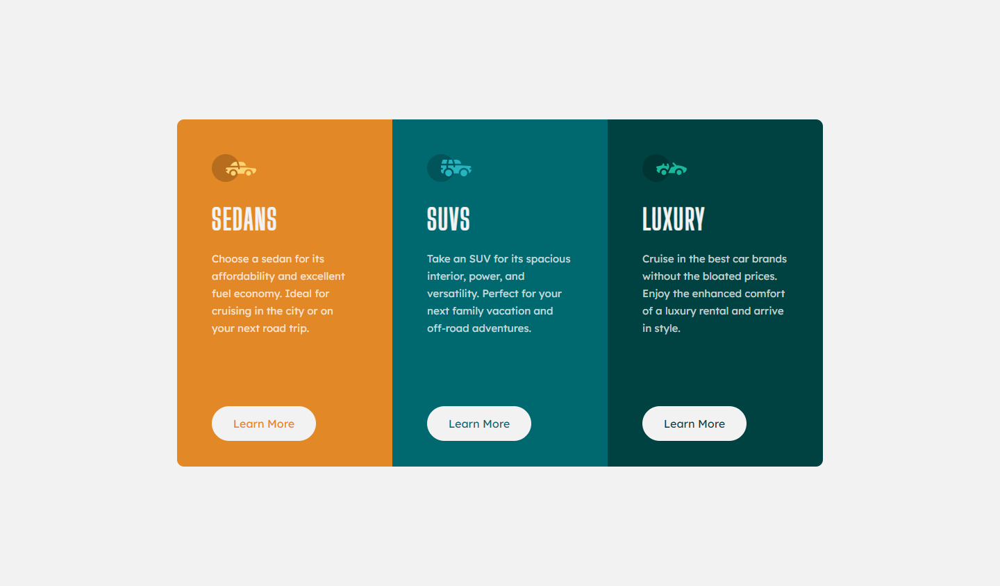
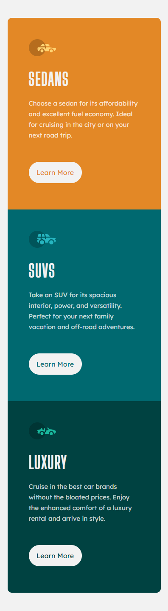

# Frontend Mentor - 3-column preview card component solution

This is a solution to the [3-column preview card component challenge on Frontend Mentor](https://www.frontendmentor.io/challenges/3column-preview-card-component-pH92eAR2-). Frontend Mentor challenges help you improve your coding skills by building realistic projects. 

## Table of contents

- [Overview](#overview)
  - [The challenge](#the-challenge)
  - [Screenshot](#screenshot)
- [My process](#my-process)
  - [Built with](#built-with)
  - [What I learned](#what-i-learned)
  - [Continued development](#continued-development)
- [Author](#author)


## Overview

### The challenge

The design should be able to be viewed properly on desktop and mobiles.

### Screenshot


<p align="center">
  
</p>

## My process

### Built with

- Semantic HTML5 markup
- CSS properties
- CSS grid system

### What I learned

I learnt how to construct the layout with divs in HTML and grid property in CSS and how to resize divs with the grid system to make it easy to turn the design to a responsive one

for example:

This is the grid container in desktop view
```css
.card-grid {
  border-radius: 10px;
  overflow: hidden;
  display: grid;
  grid-template-columns: repeat(3, 310px);
  grid-template-rows: 500px;
}
```
and this is the grid container in the mobile view
```css
.card-grid {
    grid-template-columns: 100%;
    grid-template-rows: repeat(3, 450px);
  }
}
```


### Continued development

I will practice more on using the grid system because it makes your page easy to response changes in width and height and make it easy to adapt on any screen with few lines of code

## Author

- Behance - [Mahmoud Ashraf](https://www.behance.net/m_ashraffarouk/)
- Frontend Mentor - [@m-Ash1](https://www.frontendmentor.io/profile/m-Ash1)
- Twitter - [@m_ashraffarouk](https://www.twitter.com/m_ashraffarouk)


